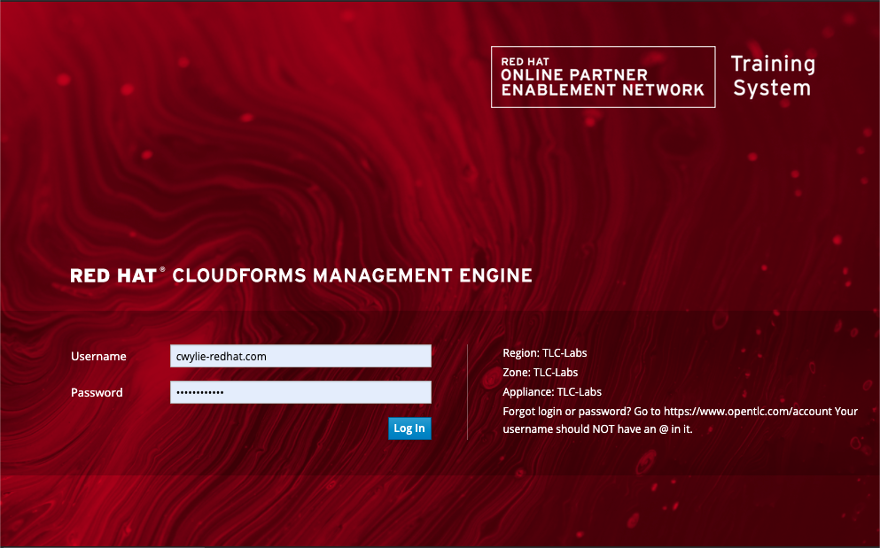
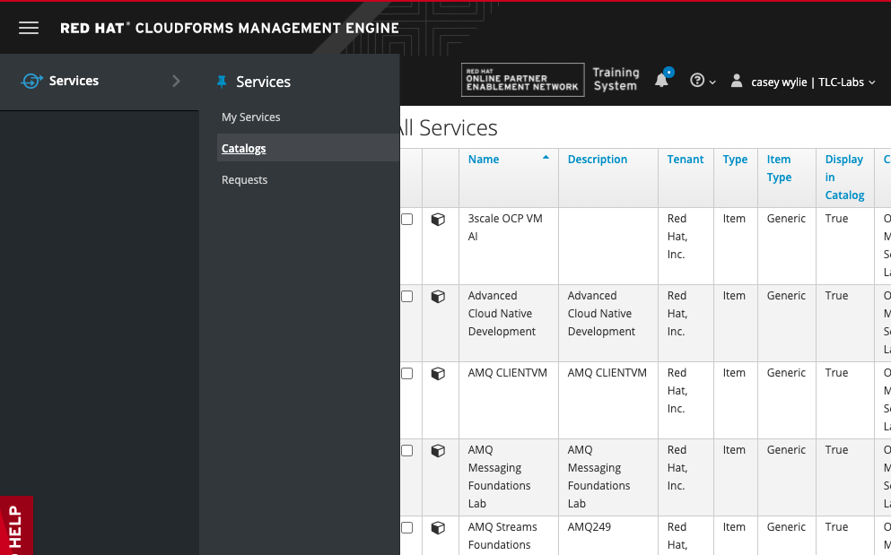
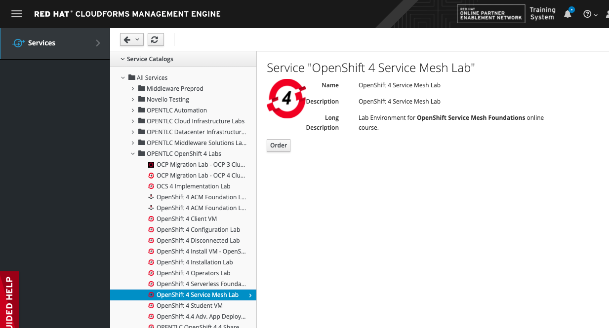

# Provision and Setup Serverless Environment  

>Updated and verified on September 15, 2020
>- Provision OpenShift Service Mesh Lab in OpenTLC
>- Setup projects to be used throughout the remainder of the lab
>- Install operators to be used throughout the remainder of the lab
>- Install Service Mesh Control Plane and Service Mesh MemberRoll in istio-system namespace 
>- Install AMQ Streams (Kafka) resources in amq-clusters namespace
>- Install Redis service in courie-data namespace
>- Install resources for Courie CICD Pipeline

Welcome to the Service Mesh Application Development labs. Today we are going to walk you through how to get your environment set up and ready to perform service mesh related tasks in future labs. In the first section of this lab will start by show you how to order your lab environment from OpenTLC labs.

## Provision OpenShift Service Mesh Lab in OpenTLC
Open [https://labs.opentlc.com/](https://labs.opentlc.com/) in your browser of choice and sign in with your OpenTLC username.   
_Your username is your Red Hat email with a dash in place of the @._   
<!--  -->
1. Sign in
2. Click *Services*
3. Click *Catalogs*
4. Click *OPENTLC OpenShift 4 Labs*
5. Click *OpenShift 4 Service Mesh Lab*
6. Click *Order*.   
   
